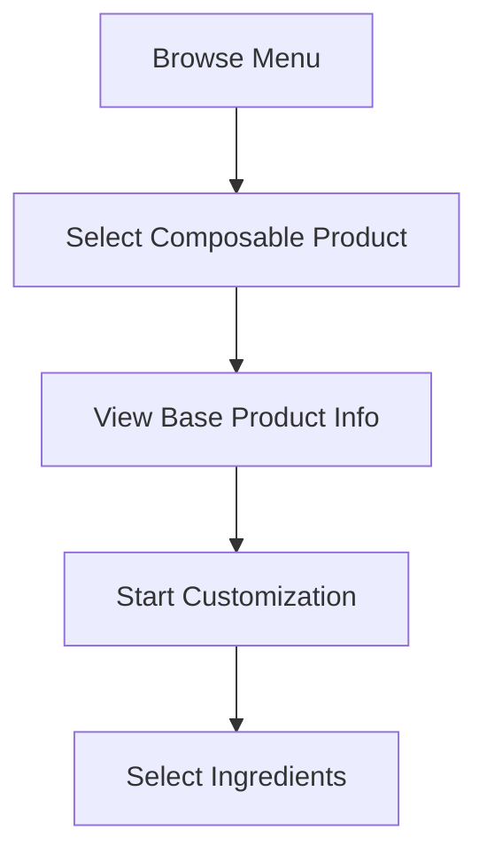

# Composable Products System

The Composable Products System allows customers to build custom menu items by selecting from available ingredients, giving them freedom of choice within defined limits while maintaining operational efficiency.

## Overview

Composable Products enable:
- **Custom Product Building**: Customers create personalized items
- **Ingredient Selection**: Choose from categorized ingredient groups
- **Dynamic Pricing**: Real-time price calculation based on selections
- **Inventory Integration**: Ingredient availability affects options
- **Nutritional Tracking**: Automatic nutritional information calculation
- **Allergen Management**: Clear allergen information and warnings

## Key Concepts

### 🧱 **Base Products**
The foundation items that customers customize:
- **Bowls**: Grain bowls, salad bowls, smoothie bowls
- **Sandwiches**: Wraps, subs, paninis
- **Pizzas**: Different crust and size options
- **Beverages**: Juices, smoothies, coffee drinks

### 🥗 **Ingredient Groups**
Organized categories of ingredients:
- **Proteins**: Meats, plant-based proteins, legumes
- **Vegetables**: Fresh, roasted, pickled options
- **Grains**: Rice, quinoa, pasta, bread options
- **Sauces**: Dressings, spreads, condiments
- **Extras**: Nuts, seeds, cheese, premium add-ons

### 💰 **Pricing Rules**
Flexible pricing strategies:
- **Base Price**: Starting price for the base product
- **Ingredient Pricing**: Individual ingredient costs
- **Bundle Pricing**: Discounts for ingredient combinations
- **Portion Pricing**: Different prices for portion sizes

## Setting Up Composable Products

### Prerequisites
- RestoPos admin access
- Ingredient inventory set up
- Base product definitions
- Pricing strategy defined

### Step 1: Create Base Products

1. **Navigate to Product Management**
   ```
   Admin → Products → Composable Products
   ```

2. **Add New Base Product**
   ```php
   // Example: Custom Bowl
   Name: "Build Your Bowl"
   Type: "Composable"
   Base Price: $8.99
   Category: "Bowls"
   Description: "Create your perfect bowl with fresh ingredients"
   ```

3. **Configure Product Settings**
   - Set minimum and maximum ingredient selections
   - Define required ingredient groups
   - Set portion size options
   - Configure allergen tracking

### Step 2: Set Up Ingredient Groups

1. **Create Ingredient Categories**
   ```
   Admin → Inventory → Ingredient Groups
   ```

2. **Define Group Rules**
   ```yaml
   Protein Group:
     - Selection Type: Single Choice
     - Required: Yes
     - Max Selections: 1
     - Options: [Chicken, Beef, Tofu, Beans]
   
   Vegetable Group:
     - Selection Type: Multiple Choice
     - Required: No
     - Max Selections: 5
     - Options: [Lettuce, Tomatoes, Cucumbers, Peppers]
   ```

3. **Set Ingredient Pricing**
   ```
   Base Ingredients: $0.00 (included in base price)
   Premium Proteins: +$2.00 - $4.00
   Extra Vegetables: +$0.50 each
   Premium Sauces: +$1.00
   ```

### Step 3: Configure Business Rules

1. **Inventory Integration**
   - Link ingredients to inventory items
   - Set minimum stock levels for availability
   - Configure out-of-stock behavior

2. **Nutritional Tracking**
   - Enter nutritional data for each ingredient
   - Enable automatic calculation
   - Set up allergen warnings

3. **Operational Limits**
   - Maximum customization complexity
   - Kitchen preparation time estimates
   - Special handling requirements

## Customer Experience Flow

### 1. **Product Selection**


### 2. **Ingredient Selection Process**

#### Step 1: Choose Base Options
- **Size Selection**: Small, Medium, Large
- **Base Type**: For bowls - rice, quinoa, greens
- **Preparation Style**: Grilled, raw, steamed

#### Step 2: Required Selections
- **Protein Choice**: Select from available proteins
- **Primary Vegetables**: Choose main vegetable components
- **Sauce Selection**: Pick primary sauce or dressing

#### Step 3: Optional Add-ons
- **Extra Vegetables**: Additional vegetable options
- **Premium Ingredients**: Avocado, nuts, premium cheeses
- **Extra Sauces**: Additional dressings or condiments

### 3. **Real-time Feedback**
- **Price Updates**: Live price calculation as selections change
- **Nutritional Info**: Calories, macros, allergens update
- **Availability**: Ingredients gray out when unavailable
- **Recommendations**: Suggested combinations and popular choices

## Example Implementations

### 🥗 **Custom Salad Bowl**
```yaml
Base Product: "Build Your Salad"
Base Price: $7.99

Required Groups:
  Greens (Choose 1):
    - Mixed Greens ($0.00)
    - Spinach ($0.00)
    - Kale (+$0.50)
    - Arugula (+$0.50)
  
  Protein (Choose 1):
    - Grilled Chicken (+$3.00)
    - Salmon (+$5.00)
    - Tofu (+$2.00)
    - Chickpeas (+$1.00)

Optional Groups:
  Vegetables (Choose up to 5):
    - Tomatoes, Cucumbers, Peppers ($0.00 each)
    - Avocado (+$2.00)
    - Roasted Beets (+$1.00)
  
  Dressing (Choose 1):
    - House Vinaigrette ($0.00)
    - Caesar (+$0.50)
    - Tahini (+$1.00)
```

### 🍕 **Custom Pizza**
```yaml
Base Product: "Build Your Pizza"
Base Price: $12.99 (Medium)

Size Options:
  - Small: $10.99
  - Medium: $12.99
  - Large: $15.99

Required Groups:
  Sauce (Choose 1):
    - Tomato Sauce ($0.00)
    - White Sauce (+$1.00)
    - Pesto (+$1.50)
  
  Cheese (Choose 1):
    - Mozzarella ($0.00)
    - Mixed Cheese (+$1.00)
    - Vegan Cheese (+$2.00)

Optional Groups:
  Meats (Choose up to 3):
    - Pepperoni (+$2.00)
    - Sausage (+$2.00)
    - Chicken (+$2.50)
  
  Vegetables (Choose up to 5):
    - Mushrooms, Peppers, Onions (+$1.00 each)
    - Artichokes, Sun-dried Tomatoes (+$1.50 each)
```

### 🥤 **Custom Smoothie**
```yaml
Base Product: "Build Your Smoothie"
Base Price: $6.99

Required Groups:
  Base Liquid (Choose 1):
    - Almond Milk ($0.00)
    - Coconut Milk (+$0.50)
    - Protein Milk (+$1.00)
  
  Fruits (Choose 2-4):
    - Banana, Strawberries, Blueberries ($0.00 each)
    - Mango, Pineapple (+$0.50 each)
    - Acai (+$2.00)

Optional Groups:
  Boosters (Choose up to 2):
    - Protein Powder (+$2.00)
    - Chia Seeds (+$1.00)
    - Spirulina (+$1.50)
```

## Advanced Features

### 🎯 **Smart Recommendations**
- **Popular Combinations**: Show frequently ordered combinations
- **Complementary Ingredients**: Suggest ingredients that pair well
- **Dietary Preferences**: Recommend based on dietary restrictions
- **Seasonal Suggestions**: Highlight seasonal ingredients

### 📊 **Nutritional Intelligence**
- **Real-time Calculations**: Live nutritional information updates
- **Dietary Goals**: Help customers meet specific nutritional targets
- **Allergen Warnings**: Clear warnings for allergen-containing ingredients
- **Macro Balancing**: Suggest ingredients to balance macronutrients

### 💡 **Operational Intelligence**
- **Preparation Time**: Estimate kitchen preparation time
- **Complexity Scoring**: Rate customization complexity for kitchen
- **Inventory Optimization**: Suggest alternatives for low-stock items
- **Cost Management**: Track ingredient costs and profitability

## Kitchen Integration

### Order Display
- **Clear Instructions**: Detailed preparation instructions
- **Ingredient Lists**: Complete ingredient breakdown
- **Special Notes**: Customer preferences and modifications
- **Allergen Alerts**: Prominent allergen warnings

### Preparation Workflow
1. **Order Receipt**: Kitchen receives detailed customization
2. **Ingredient Gathering**: Staff collect all required ingredients
3. **Preparation Steps**: Follow customization instructions
4. **Quality Check**: Verify all customizations are correct
5. **Completion**: Mark order as ready

## Inventory Management

### Stock Tracking
- **Real-time Updates**: Ingredient availability updates automatically
- **Low Stock Alerts**: Warnings when ingredients run low
- **Automatic Hiding**: Unavailable ingredients hidden from customers
- **Substitute Suggestions**: Offer alternatives for unavailable items

### Cost Control
- **Ingredient Costing**: Track individual ingredient costs
- **Profitability Analysis**: Monitor profit margins on custom items
- **Waste Tracking**: Monitor ingredient waste and usage
- **Supplier Integration**: Automatic reordering for popular ingredients

## Analytics and Insights

### Customer Preferences
- **Popular Combinations**: Most frequently selected ingredient combinations
- **Ingredient Popularity**: Most and least popular ingredients
- **Customization Patterns**: How customers typically customize products
- **Seasonal Trends**: Ingredient popularity by season

### Business Intelligence
- **Revenue Impact**: Revenue generated from composable products
- **Margin Analysis**: Profitability of different ingredient combinations
- **Operational Efficiency**: Kitchen preparation time analysis
- **Customer Satisfaction**: Feedback on customization experience

## Best Practices

### Menu Design
- **Logical Grouping**: Organize ingredients in intuitive categories
- **Clear Descriptions**: Provide detailed ingredient descriptions
- **Visual Appeal**: Use high-quality images for ingredients
- **Pricing Transparency**: Make pricing clear and understandable

### Operational Efficiency
- **Prep Organization**: Organize kitchen for efficient customization
- **Staff Training**: Train staff on customization procedures
- **Quality Control**: Maintain consistency across custom orders
- **Time Management**: Balance customization with service speed

### Customer Experience
- **Guided Experience**: Help customers make good choices
- **Reasonable Limits**: Set sensible limits on customization
- **Quick Options**: Provide pre-designed popular combinations
- **Educational Content**: Explain ingredients and their benefits

## Troubleshooting

### Common Issues

**Issue**: Customers overwhelmed by too many options
**Solution**: 
- Implement progressive disclosure
- Provide recommended combinations
- Use clear categorization
- Offer "quick build" options

**Issue**: Kitchen struggles with complex customizations
**Solution**:
- Simplify preparation instructions
- Provide staff training
- Use visual order displays
- Implement complexity limits

**Issue**: Ingredient availability not updating
**Solution**:
- Check inventory integration settings
- Verify real-time sync configuration
- Test inventory update triggers
- Review caching settings

## Next Steps

1. **[Ingredient Setup](./ingredient-setup.md)** - Configure your ingredient inventory
2. **[Pricing Strategy](./pricing-strategy.md)** - Set up dynamic pricing rules
3. **[Kitchen Integration](./kitchen-integration.md)** - Integrate with kitchen operations
4. **[Analytics Setup](./analytics-setup.md)** - Track composable product performance
5. **[Advanced Customization](./advanced-customization.md)** - Implement advanced features

---

*Need help? Check our [troubleshooting guide](./troubleshooting.md) or [contact support](../support.md).*