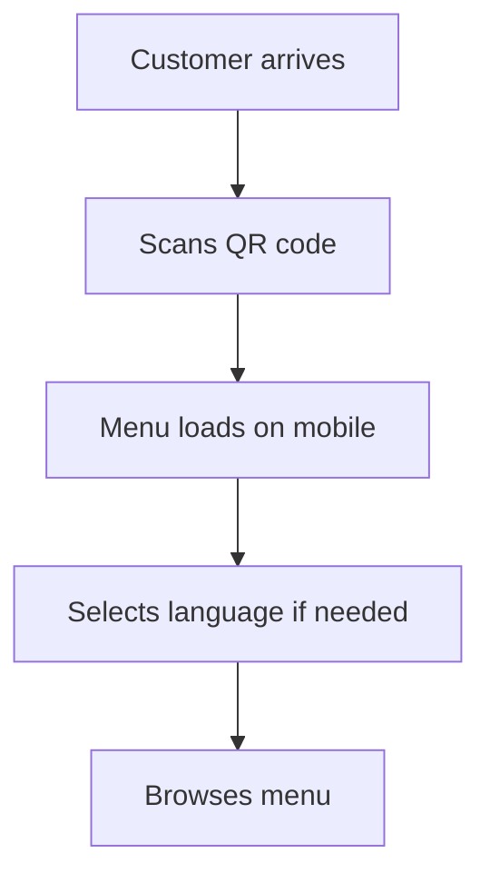

# Customer Ordering Portal

The RestoPos Customer Ordering Portal provides a seamless mobile-first ordering experience accessed via QR codes. Customers can browse menus, customize orders, and pay directly from their mobile devices.

## Overview

The Customer Ordering Portal is designed for:
- **QR Code Access**: Customers scan QR codes to access the menu
- **Mobile-First Design**: Optimized for smartphones and tablets
- **Contactless Ordering**: Reduce physical contact and wait times
- **Real-time Updates**: Live menu and pricing information
- **Multi-language Support**: Arabic (RTL), English, and French
- **Composable Products**: Custom ingredient selection

## Key Features

### 📱 **Mobile-Optimized Interface**
- Responsive design for all screen sizes
- Touch-friendly navigation and buttons
- Fast loading times on mobile networks
- Offline capability for basic browsing

### 🔍 **Smart Menu Navigation**
- Category-based organization
- Search functionality with filters
- Popular items highlighting
- Dietary restriction filtering

### 🛒 **Advanced Ordering**
- Real-time cart management
- Order modification and customization
- Special instructions and notes
- Order history and reordering

### 💳 **Integrated Payments**
- Multiple payment methods
- Secure payment processing
- Digital receipts
- Tip calculation and processing

## Quick Setup Guide

### Prerequisites
- RestoPos system installed and configured
- Menu items and categories set up
- Payment methods configured
- QR code generation capability

### Step 1: Configure Customer Portal Settings

1. **Access Admin Panel**
   ```
   Navigate to: Admin → Settings → Customer Portal
   ```

2. **Basic Configuration**
   - Enable customer ordering
   - Set default language
   - Configure ordering hours
   - Set minimum order amounts

3. **Payment Settings**
   - Enable payment methods
   - Configure payment processors
   - Set tip options and defaults
   - Configure tax calculations

### Step 2: Generate QR Codes

1. **Table-Specific QR Codes**
   ```
   Admin → Tables → Generate QR Codes
   ```
   - Each table gets a unique QR code
   - QR codes include table identification
   - Printable formats available

2. **General QR Codes**
   - Takeaway ordering QR codes
   - Delivery ordering access
   - General menu browsing codes

### Step 3: Test the Customer Experience

1. **Scan QR Code**
   - Use your mobile device to scan a generated QR code
   - Verify the menu loads correctly
   - Test navigation and search functionality

2. **Place Test Order**
   - Add items to cart
   - Customize products if applicable
   - Complete checkout process
   - Verify order appears in admin panel

## Customer Journey

### 1. **Arrival & QR Code Scan**


### 2. **Menu Browsing & Selection**
- **Category Navigation**: Browse by food categories
- **Search & Filter**: Find specific items or dietary options
- **Item Details**: View descriptions, ingredients, allergens
- **Customization**: Select options for composable products

### 3. **Cart Management**
- **Add to Cart**: Items added with selected options
- **Modify Quantities**: Increase/decrease item quantities
- **Special Instructions**: Add notes for kitchen
- **Review Order**: Final order review before checkout

### 4. **Checkout Process**
- **Order Type Selection**: Dine-in, takeaway, or delivery
- **Customer Information**: Contact details if required
- **Payment Method**: Select and process payment
- **Order Confirmation**: Receive order number and estimated time

## Composable Products Integration

### Understanding Composable Products
Composable products allow customers to build custom items by selecting:
- **Base Items**: Main product (bowl, sandwich, pizza)
- **Ingredients**: Available add-ons and modifications
- **Portions**: Size and quantity options
- **Restrictions**: Dietary and allergen considerations

### Customer Experience
1. **Select Base Product**
   - Choose from available composable items
   - View base price and description

2. **Customize Ingredients**
   - Select from categorized ingredients
   - View price adjustments for each addition
   - See real-time total price updates

3. **Review Custom Creation**
   - Confirm all selected options
   - View nutritional information if available
   - Add special preparation instructions

### Example: Custom Bowl Creation
```
1. Base: Quinoa Bowl ($8.99)
2. Proteins: Grilled Chicken (+$3.00)
3. Vegetables: Roasted Vegetables (+$1.50)
4. Sauce: Tahini Dressing (+$0.50)
5. Extras: Avocado (+$2.00)

Total: $15.99
```

## Multi-Language Support

### Supported Languages
- **English**: Default language with full feature support
- **Arabic**: Right-to-left (RTL) layout with cultural adaptations
- **French**: Complete translation with regional formatting

### Language Switching
- Automatic detection based on device settings
- Manual language selection available
- Persistent language preference storage
- Currency and date formatting adaptation

## Mobile Optimization Features

### Performance Optimization
- **Image Compression**: Optimized images for mobile networks
- **Lazy Loading**: Load content as needed to improve speed
- **Caching**: Store frequently accessed data locally
- **Progressive Web App**: App-like experience in browser

### User Experience Enhancements
- **Touch Gestures**: Swipe navigation and touch interactions
- **Haptic Feedback**: Vibration feedback for actions
- **Voice Search**: Voice-activated menu search
- **Accessibility**: Screen reader and accessibility support

## Order Management Integration

### Real-time Order Tracking
- Order status updates (received, preparing, ready)
- Estimated completion times
- Kitchen communication integration
- Notification system for order updates

### Kitchen Integration
- Orders appear on kitchen display system
- Special instructions clearly visible
- Ingredient availability affects menu display
- Order prioritization and timing

## Troubleshooting Common Issues

### QR Code Problems
**Issue**: QR code doesn't scan properly
**Solutions**:
- Ensure QR code is printed clearly and at adequate size
- Check lighting conditions for scanning
- Verify QR code URL is accessible
- Test with different QR code scanner apps

### Menu Loading Issues
**Issue**: Menu takes too long to load
**Solutions**:
- Check internet connection strength
- Optimize image sizes and compression
- Enable caching for faster subsequent loads
- Consider offline menu capability

### Payment Processing Problems
**Issue**: Payment fails or doesn't process
**Solutions**:
- Verify payment gateway configuration
- Check SSL certificate validity
- Test with different payment methods
- Review payment processor logs

### Mobile Display Issues
**Issue**: Menu doesn't display properly on mobile
**Solutions**:
- Test responsive design on various devices
- Check CSS media queries
- Verify touch targets are appropriately sized
- Test on different mobile browsers

## Best Practices

### QR Code Placement
- **Table Placement**: Center of table, easily visible
- **Size**: Large enough to scan from normal sitting distance
- **Protection**: Laminated or protected from spills
- **Backup**: Have staff available to assist with scanning

### Menu Optimization
- **High-Quality Images**: Professional food photography
- **Clear Descriptions**: Detailed but concise item descriptions
- **Accurate Pricing**: Keep prices updated and clearly displayed
- **Availability**: Hide or mark unavailable items

### Customer Support
- **Staff Training**: Train staff to assist with mobile ordering
- **Help Documentation**: Provide simple help guides
- **Fallback Options**: Have traditional menus available
- **Technical Support**: Quick resolution for technical issues

## Analytics and Insights

### Customer Behavior Tracking
- Most popular menu items
- Average order values
- Peak ordering times
- Customer journey analytics

### Performance Metrics
- Order completion rates
- Cart abandonment analysis
- Payment success rates
- Customer satisfaction scores

## Security Considerations

### Data Protection
- Secure HTTPS connections
- PCI DSS compliance for payments
- Customer data encryption
- Privacy policy compliance

### Fraud Prevention
- Payment verification systems
- Order validation checks
- Suspicious activity monitoring
- Secure authentication methods

## Next Steps

1. **[QR Code Setup](./qr-code-setup.md)** - Generate and deploy QR codes
2. **[Menu Optimization](./menu-optimization.md)** - Optimize your menu for mobile
3. **[Payment Integration](./payment-integration.md)** - Set up payment processing
4. **[Composable Products](./composable-products.md)** - Configure custom product builder
5. **[Analytics Setup](./analytics-setup.md)** - Track customer behavior and performance

---

*Need help? Check our [troubleshooting guide](./troubleshooting.md) or [contact support](../support.md).*